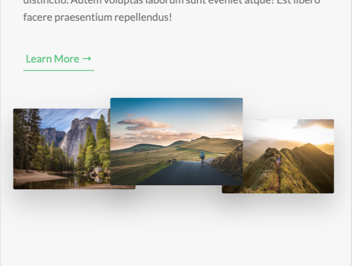
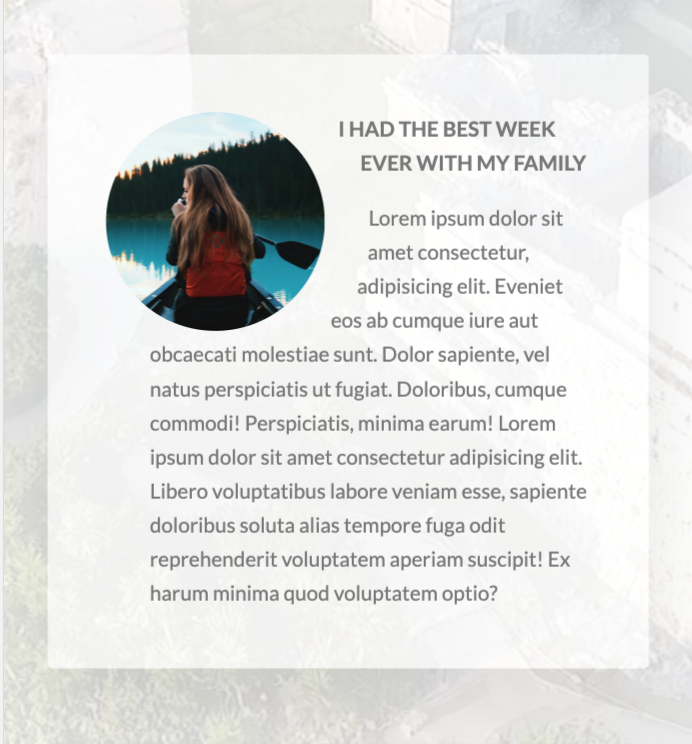

## [Natours](https://rafgarciaa.github.io/Natours/)
A mockup landing page for a travel agency startup. This coding exercise capitalizes on the capabilities of HTML and CSS.

## Goals
1) Be up to speed with the most modern and advanced CSS properties and techniques;
2) Be ready to build responsive layouts for all kind of devices and situations;
3) Truly understand how CSS works behind the scenes;
4) Be able to architect large CSS codebases for reusability and maintainability using Sass.

## Features & Code Snippets
These are some of the key features of this landing page. It's amazing how we can capitalize the different tricks and techniques available in CSS.

---

### ```@keyframes``` animations
this feature allows for elements to transition from one position to another. This is achieved by defining where elements are positioned at the beginning and at the end of the animation (defined as 0% - 100%  - see below).


<p align="center">
    
</p>

```css
@keyframes moveInLeft {
    /* Before the animation starts */
    0% {
        opacity: 0;
        transform: translateX(-10rem);
    }

    /* 60% {
        transform: rotate(180deg);
    } */

    80% {
        transform: translateX(1rem);
    }

    /* When the animation ends */
    100% {
        opacity: 1;
        transform: translate(0);
    }
}

@keyframes moveInRight {
    /* Before the animation starts */
    0% {
        opacity: 0;
        transform: translateX(10rem);
    }

    80% {
        transform: translateX(-1rem);
    }

    /* When the animation ends */
    100% {
        opacity: 1;
        transform: translate(0);
    }
}

@keyframes moveInBottom {
    /* Before the animation starts */
    0% {
        opacity: 0;
        transform: translateY(3rem);
    }
    
    /* When the animation ends */
    100% {
        opacity: 1;
        transform: translateX(0);
    }
}
```

### Image Transitions
Each image is emphasized as it's hovered over giving a 3d-esque feel to the webpage. This is achieved by scaling-up the current image being hovered over and scale-down the other photos.

<p align="center">
    
</p>

```css
.composition {
    position: relative;

    // photo styling
    &__photo {
        width: 55%;
        box-shadow: 0 1.5rem 4rem rgba($color-black, .4);
        border-radius: 2px;
        position: absolute;
        z-index: 10;
        transition: all .2s;
        outline-offset: 2rem;

        // photo positions
        &--p1 {
            left: 0;
            top: -2rem;
        }

        &--p2 {
            right: 0;
            top: 3rem;
        }

        &--p3 {
            left: 20%;
            top: 12rem;
        }

        // hover effect on all photos
        &:hover {
            outline: 1.5rem solid $color-primary;
            transform: scale(1.05) translateY(-.5rem);
            box-shadow: 0 2.5rem 4rem rgba($color-black, .5);
            z-index: 100;
        }
    }

    // composition:hover composition__photo:not(:hover)
    // all the photos except the photo currently hovered will scale smaller
    &:hover &__photo:not(:hover) {
        transform: scale(.95);
    }
}
```

### Card Animations
Probably my most favorite feature of this page. This card animation is achieved by creating two div elements, front-side and back side, styled to be on top of each other achieved by the property ```backface-visibility: hidden``` and then giving each side it's own styling accordingly. This segment of this page also reuses the button component similar to the "Discover our tours" button at the top of the page.

<p align="center">
    
</p>

```css
&__side {
    height: 52rem;
    transition: all .8s ease;
    position: absolute;
    top: 0;
    left: 0;
    width: 100%;
    backface-visibility: hidden;
    border-radius: 3px;
    overflow: hidden; // this is written bc the image overflows on top of the parent element which is the card (therefore remove the border radius)
    box-shadow: 0 1.5rem 4rem rgba($color-black, .15);
    
    &--front {
        background-color: $color-white;
    }
    
    &--back {
        transform: rotateY(180deg);

        &-1 {
            background-image: linear-gradient(to right bottom, $color-secondary-light, $color-secondary-dark);
        }

        &-2 {
            background-image: linear-gradient(to right bottom, $color-primary-light, $color-primary-dark);
        }

        &-3 {
            background-image: linear-gradient(to right bottom, $color-tertiary-light, $color-tertiary-dark);
        }
    }
}

&:hover &__side--front {
    transform: rotateY(-180deg);
}

&:hover &__side--back {
    transform: rotateY(0);
}
```

### Stories Section
This landing page also features a stories section where people review their experiences of the tours. The main highlights of this page is the background video (for this entire section), the container of the review being skewed into a parallelogram shape, and how the text *wraps* around the shape of the image.

<p align="center">
    
</p>

The background video styling is achieved by position the video element absolute, relative to its parent container. It was also given a relatively low z-index and a slightly lower opacity to give it a blur effect. Lastly, it was given a object-fit property of cover to make sure that the video's aspect ratio is kept.

```css
.bg-video {
    position: absolute;
    top: 0;
    left: 0;
    height: 100%;
    width: 100%;
    z-index: -100;
    opacity: .15;
    overflow: hidden;

    &__content {
        height: 100%;
        width: 100%;
        object-fit: cover;
    }
}
```

<p align="center">
    
</p>

For the main content of this features section, we can see that the container is skewed into a parallelogram shape, and the text *wraps* around the image. The parallelogram shape of background of the container is achieved by skewing it by x degrees (in this case -12 degrees as seen below), and making sure that the rest of the contents inside of the container itself is skewed 12 degrees (opposite of its parent container).

Now the *wrapping around* of the text to the shape of the image is achieved by using CSS propert called, `shape-outside` and giving its specified values. Note however, that this will only work if the element has defined dimensions (width and height as seen on the code below).

```css
.story {
    transform: skewX(-12deg);

    &__shape {
        width: 15rem;
        height: 15rem;
        float: left;
        // shape outside only works if the element has a property of float, width and height
        -webkit-shape-outside: circle(50% at 50% 50%);
        shape-outside: circle(50% at 50% 50%);
        -webkit-clip-path: circle(50% at 50% 50%);
        clip-path: circle(50% at 50% 50%);
        transform: translateX(-3rem) skewX(12deg);
    }
}
```

Additionally, the image itself scales-down and blurs as this content section is hovered over. This can be achieved by using a CSS property called `filter` and a value of `blur` as seen in the code below.

```css
&:hover &__img {
    transform: translateX(-4rem) scale(1);
    filter: blur(3px) brightness(80%);
}
```

## Responsive Design
This page also utilizes a responsive design to provide seamless user-experience to all users across all devices. This is achieved by utilizing a ```mixin``` where it takes in a breakpoint and with that, determins the max-width of the current viewport the app is being viewed from.

```css
@mixin respond($breakpoint) {
    @if $breakpoint == phone {
        @media (max-width: 37.5em) { @content }; // 600px
    }

    @if $breakpoint == tab-port {
        @media (max-width: 56.25em) { @content }; // 900px
    }

    @if $breakpoint == tab-land {
        @media (max-width: 75em) { @content }; // 1200px
    }

    @if $breakpoint == big-desktop {
        @media (min-width: 112.5em) { @content }; // 1800px
    }
}
```

### Key Feature Differences from Desktop/Laptop App

#### Images
Images are aligned differently in tablet/mobile screens.
<p align="center">
    
</p>

#### Cards
Since there is no cursors
<p align="center">
    
</p>

#### Features
<p align="center">
    
</p>

## Technologies & Tools
+ HTML5
+ CSS3
+ npm
+ node-sass
+ live-server